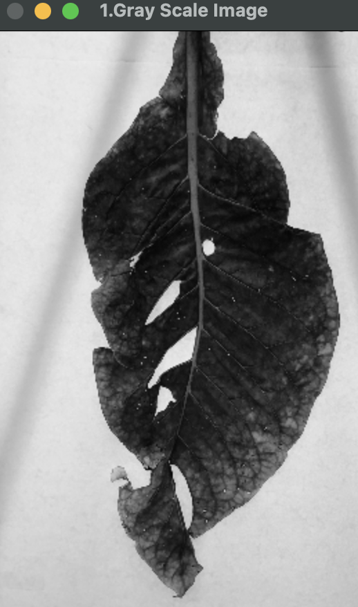
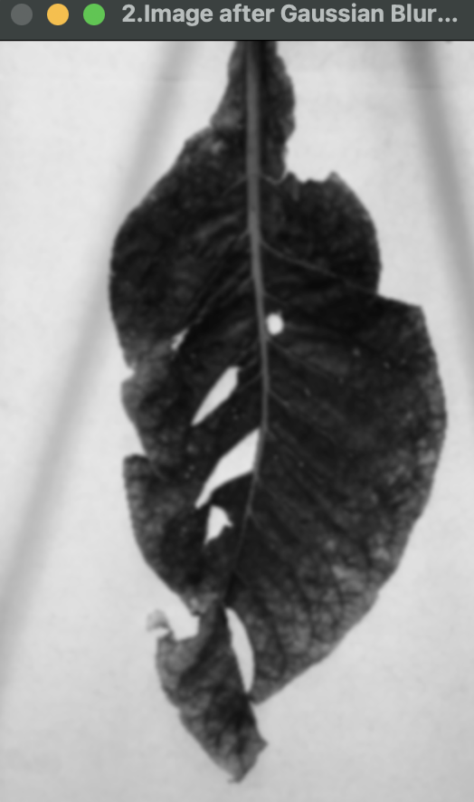

## Image Processing Steps

1. **Convert Image to Grayscale:**
   - The image is converted to grayscale.
    
   <table>
     <tr>
       <td></td>
     </tr>
   </table>

2. **Apply Gaussian Blur:**
   - Gaussian Blur operation is applied to the grayscale image to remove noise.
    
   <table>
     <tr>
       <td></td>
     </tr>
   </table>

