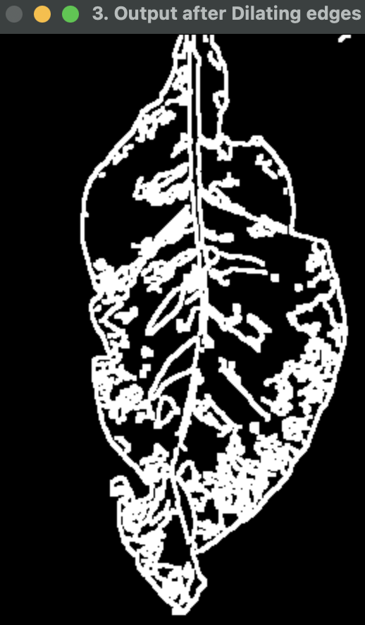
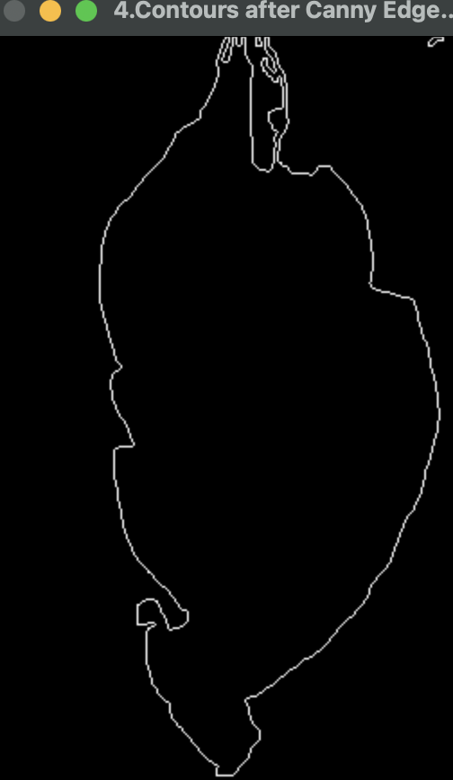
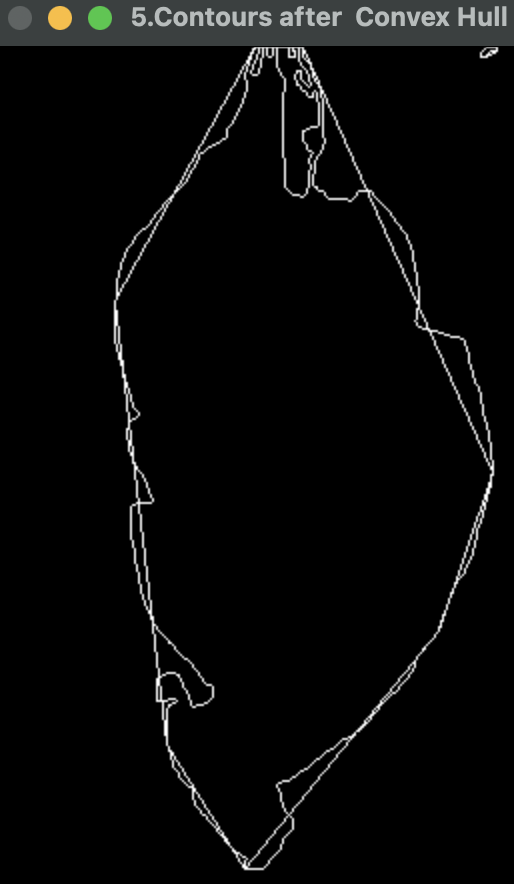
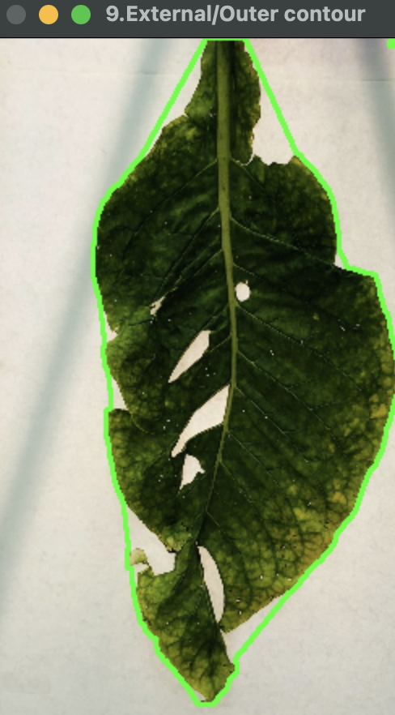
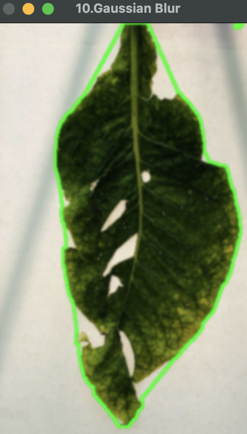
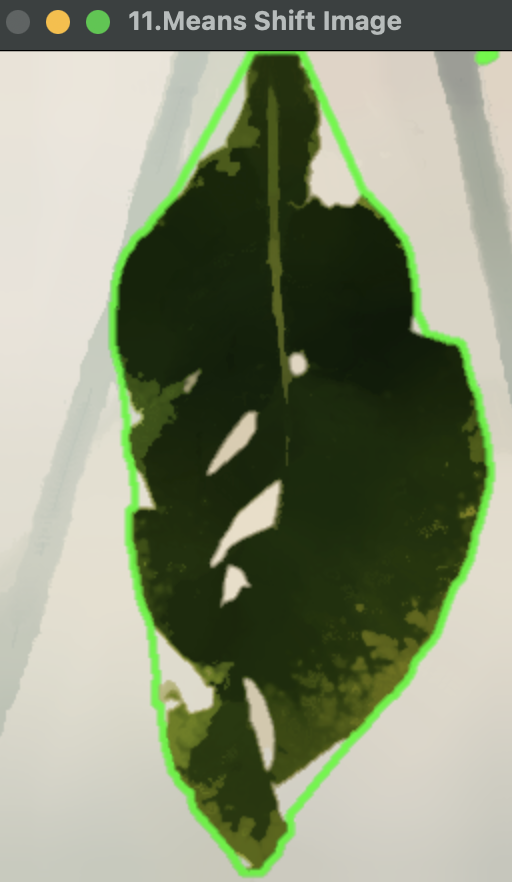
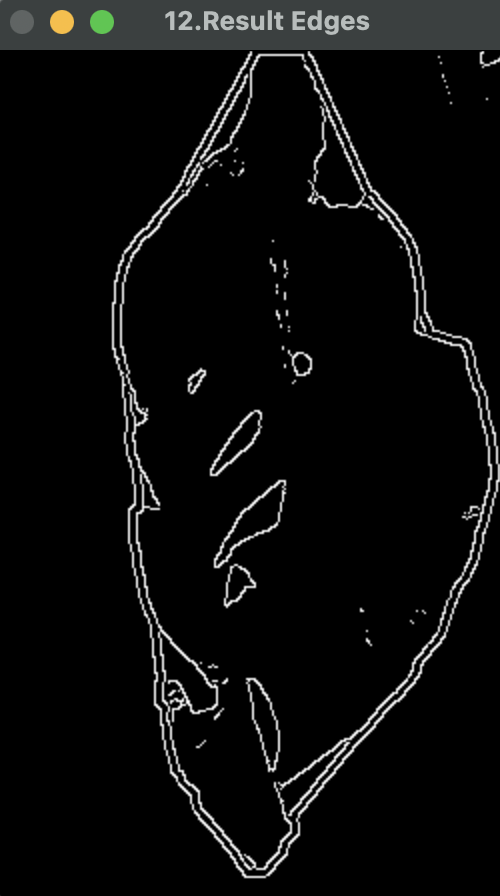
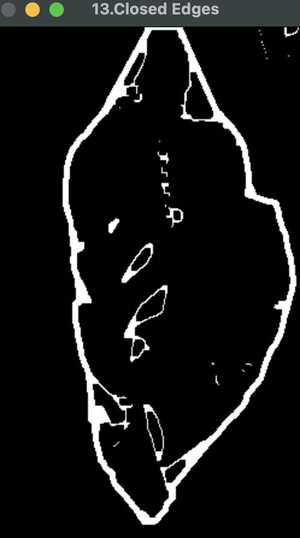
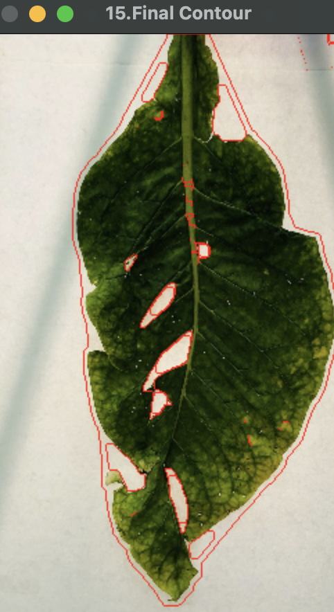

## Image Processing Steps

| Step | Description | Image |
|------|-------------|-------|
| 1 | Images are converted to gray scale to reduce complexity. |  |
| 2 | Gaussian Blur operation applied on gray scale image to remove noise. |  |
| 3 | Dilated to make it more visible. |  |
| 4 | Canny edge detection is applied to mark external boundary. |  |
| 5 | Convex hull operation applied to approximate the shape of the leaf. |  |
| 6 | Approximate shape after combining the canny with convex hull algorithm. |  |
| 7 | Application of Gaussian blur on the result image. |  |
| 8 | Further removal of noise by mean shift algorithm. |  |
| 9 | Apply canny edge detection to extract contours in the image. |  |
| 10 | Close the contours if any in the image. |  |
| 11 | Final result with all the contours in the image. |  |

